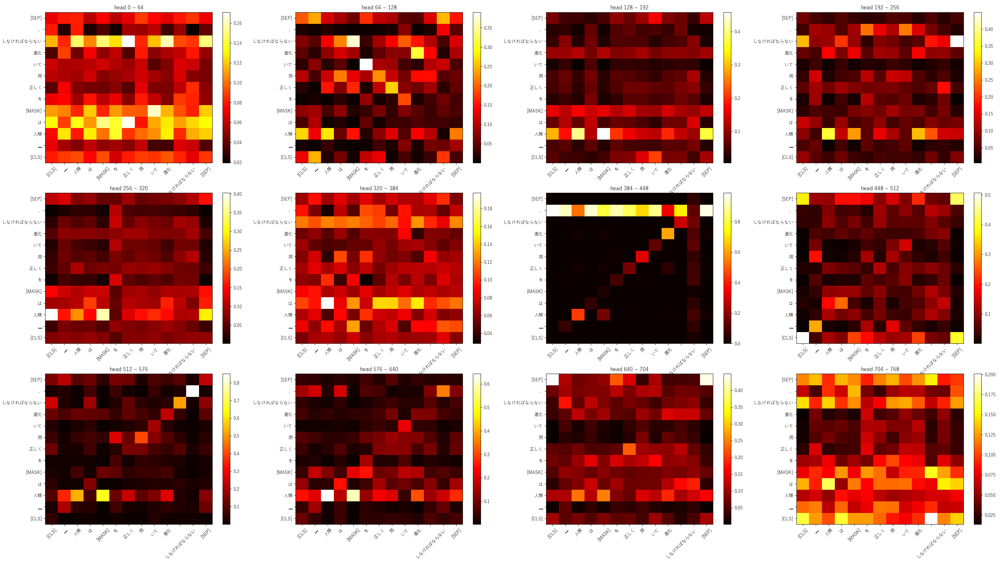
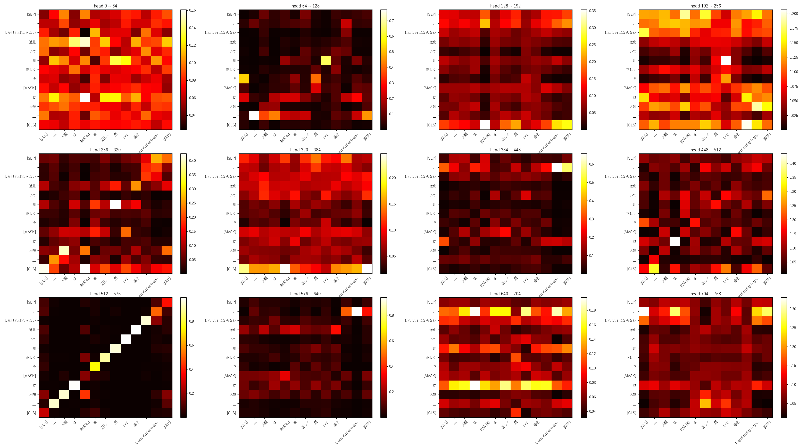

# BERT

BERT - Bidirectional Encoder Representation Transformer

<p align="center">
  
</p>

## Results

```
answer : 人類は知性を正しく用いて進化しなければならない。
masked : 人類は[MASK]を正しく用いて進化しなければならない。
albert : 人類は生物を正しく用いて進化しなければならない。
```

### Encoder 11



### Encoder 12


