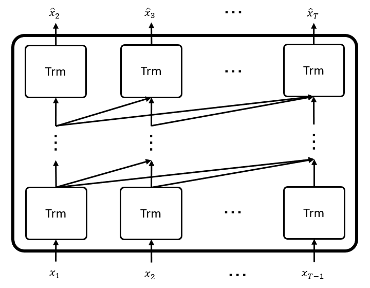

# JGPT

GPT - Japanese Generative Pretraining Transformer


<p align="center">
  
</p>

## Results

```
>人類は
人類は、この再建されたバイオエンジニアリング子宮を学習した経験のを、経済学の初めてデバイスをデバイスを学習し、その対価を切り替えない。
>魔法が
魔法が、その大きな成功を収める人だ。
>地球
地球は、後者の重要性が強調される。
>葵葉月は、
葵葉月は、その安らかなぶるな、身をかがめた。
```
