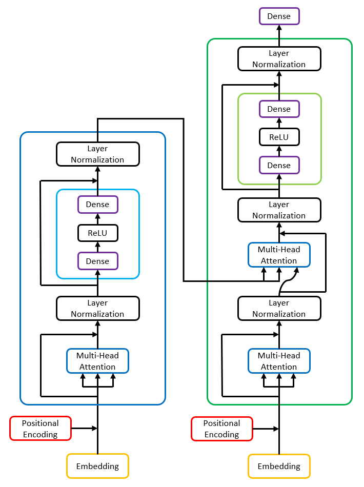
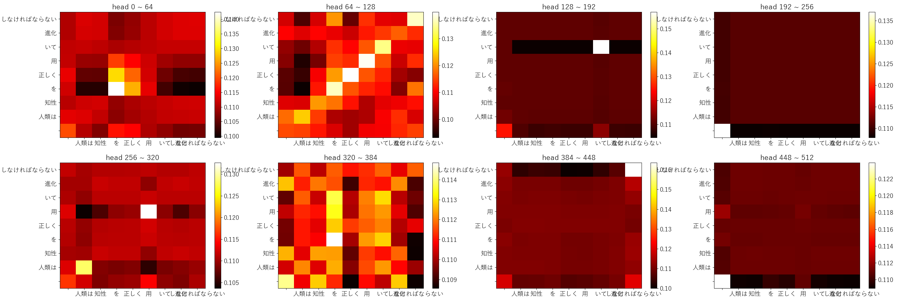

# NMTT

Machine Translation - Neural Machine Translation Transformer

<p  align="center">
  
</p>

## Results

```
>調子はどう?
>> what do you mean?
>人類は知性を正しく用いて進化しなければならない。
>> we need to change our strength.
>人間についてどう思いますか?
>> what do you think?
>すまない。
>> i'm sorry.
>明日の天気はどうですか?
>> what about the weather?
>日本語は英語より難しい。
>> the japanese is more than the japanese.
> quit
```

### Encoder 5



### Encoder 6


