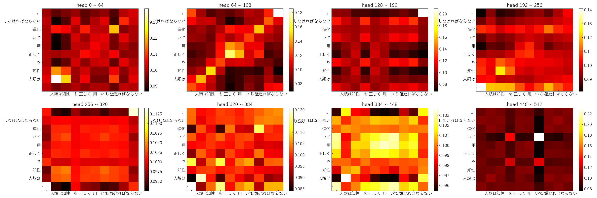

# Natural Language

## BERT

BERT - Bidirectional Encoder Representation Transformer

## Doc2Vec

Doc2Vec - Document Classication

<p align="center">
  
</p>

## NMTT

Machine Translation - Neural Machine Translation Transformer



## STSA

Chat Bot - Sequence To Sequence Attention

```
>こんにちは。
>> こんにちは。
>お疲れ様です。
>> おつありです
>フォローお願いします
>> w
>名前は何ですか
>> w
>今日はいい天気ですね
>> 暖かい
>昨日はありがとうございました。
>> こちらこそありがとうございました
>quit
```

## Word2Vec

Word2Vec - CBOW and Skip-gram

<p align="center">
  
</P>
