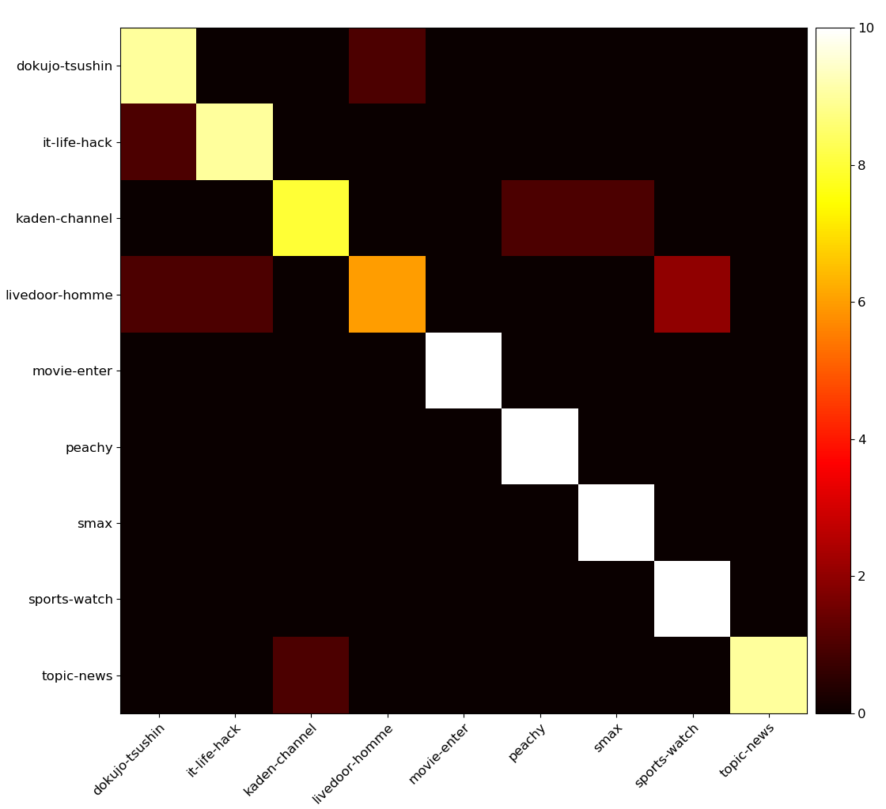

# Natural Language

## BERT

BERT - Bidirectional Encoder Representation Transformer

<p align="center">
  
</p>

## Doc2Vec

Doc2Vec - Document Classication

<p align="center">
  
</p>

## JGPT

GPT - Japanese Generative Pretraining Transformer

```
>人類は
人類は、この再建されたバイオエンジニアリング子宮を学習した経験のを、経済学の初めてデバイスをデバイスを学習し、その対価を切り替えない。
>魔法が
魔法が、その大きな成功を収める人だ。
>地球
地球は、後者の重要性が強調される。
>葵葉月は、
葵葉月は、その安らかなぶるな、身をかがめた。
```

## NMTT

Machine Translation - Neural Machine Translation Transformer


## STSA

Chat Bot - Sequence To Sequence Attention

```
>こんにちは。
>> こんにちは。
>お疲れ様です。
>> おつありです
>フォローお願いします
>> w
>名前は何ですか
>> w
>今日はいい天気ですね
>> 暖かい
>昨日はありがとうございました。
>> こちらこそありがとうございました
>quit
```

## Word2Vec

Word2Vec - CBOW and Skip-gram

<p align="center">
  
</P>
