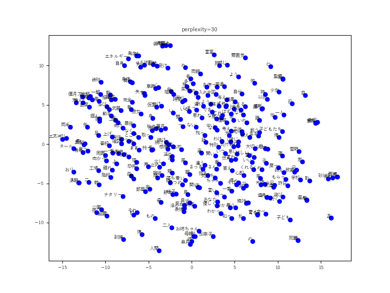

# Natural Language

## BERT

BERT - Bidirectional Encoder Representation Transformer

<p align="center">
  
</p>

## Doc2Vec

Doc2Vec - Document Classication

<p align="center">
  
</p>

## JGPT

GPT - Japanese Generative Pretraining Transformer

```
>人類は
人類は、この宇宙線が飛行士に与える影響について長年研究を重ねてきましたが、中にはこうした脳卒中です。
>魔法が
魔法が乱れている日、仕事に身が入らない日、という大きな未来からいこう刃にまるで坂道を上がっている。
>地球
地球は、量子のルールをもとに、まず、科学ジャーナリストのアドレスを割り当てが映を行ったり、学習したipアドレスで、自動的に句の選択肢やデフォルト器へのフレームワークを学習した。
>葵葉月は
葵葉月は、いつものようにあまり口を開かなかった。
```

## NMTT

Machine Translation - Neural Machine Translation Transformer


## STSA

Chat Bot - Sequence To Sequence Attention

```
>こんにちは。
>> こんにちは。
>お疲れ様です。
>> おつありです
>フォローお願いします
>> w
>名前は何ですか
>> w
>今日はいい天気ですね
>> 暖かい
>昨日はありがとうございました。
>> こちらこそありがとうございました
>quit
```

## Word2Vec

Word2Vec - CBOW and Skip-gram

<p align="center">
  
</P>
